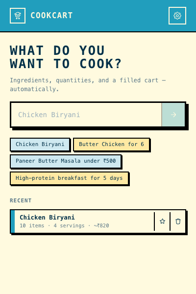
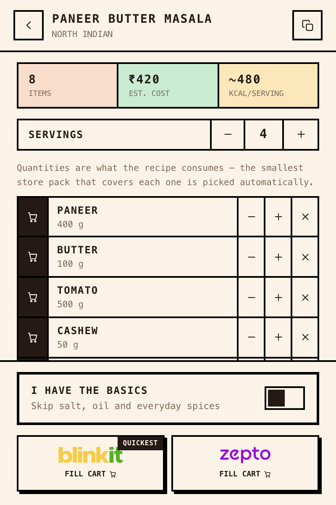
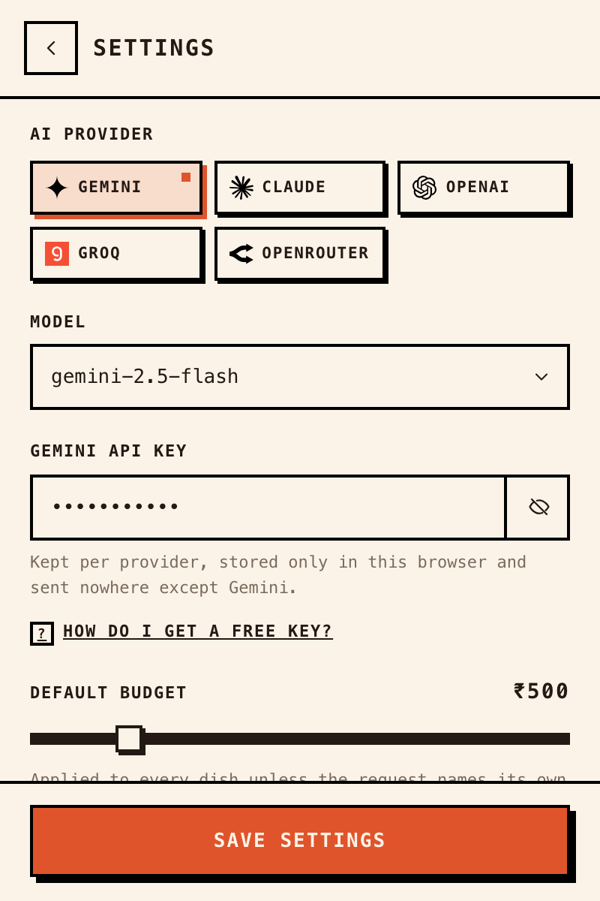

# CookCart AI

**Type any dish. Get a filled grocery cart.**

CookCart AI is a Chrome extension that turns a dish into a ready-to-checkout cart on India's quick-commerce apps. You type _"Chicken Biryani for 4"_, an LLM works out every ingredient in realistic cooking quantities, you review and tweak the list, and one click fills your **Blinkit** cart in about a second — on your own logged-in session.

<p align="center">
  
  
  
</p>

---

## What it does

1. **Ask** — describe a dish, a budget (`Paneer Butter Masala under ₹500`), servings, or a week of meal prep.
2. **Review** — the AI returns ingredients with quantities, an estimated cost and rough nutrition. Rename, substitute, resize, change servings, or skip pantry staples you already have.
3. **Fill** — pick a store. For **Blinkit**, the whole cart is built and written in ~1 second. Review it, then check out yourself.

It runs entirely on **your own logged-in browser session** — it never sees or stores your store login, and it stops at a filled cart. You place the order.

## How the 1-second Blinkit fill works

Quick-commerce apps keep the live cart in the page's own `localStorage` — adding an item fires no server call; the app syncs to the account cart at checkout. Blinkit's product search API is also same-origin and returns each product's exact add-to-cart payload. So CookCart:

1. looks every ingredient up via Blinkit's search API in parallel (bounded concurrency + backoff so it stays under the rate limit),
2. ranks the best real match with a fuzzy engine (pack-size fit, price, penalties so _tomato_ never buys ketchup),
3. builds the entire cart object and **writes it once**, then reloads so the app hydrates it.

No per-item clicking, no scraping fragility, nothing that outpaces a human by accident — it's the same requests and storage the site itself uses. The endpoints were reverse-engineered with the observation harness in [`instrument/`](instrument/).

## Store support

| Store | Status | How |
|-------|--------|-----|
| **Blinkit** | ✅ Fast & verified | Search API + one-shot `localStorage` cart write (~1s), verified against the live cart count |
| **Zepto** | ✅ Works | In-app search (drives Zepto's own search box, no reload per item) + DOM add, verified against Zepto's `localStorage` cart. Needs a delivery location set first |
| **Instamart** | 🚧 Experimental | Step-by-step DOM automation, not yet reliable |

Only Blinkit gets the sub-second path — its search API is open and unsigned. Zepto **signs** every API request (anti-bot), so it can't be called directly; CookCart instead drives Zepto's own search box (the page signs its own request) and adds through the UI — reliable, just not instant.

## Install (developer mode)

```bash
npm install
npm run build
```

Then in Chrome/Brave: `chrome://extensions` → enable **Developer mode** → **Load unpacked** → select the `dist/` folder.

### Connect an AI provider

Open the popup → gear icon → pick a provider, a model, and paste that provider's API key. Endpoints are handled internally; **each provider keeps its own key**.

| Provider | Default model | Key from |
|----------|---------------|----------|
| **Gemini** (default) | `gemini-2.5-flash` | [aistudio.google.com/apikey](https://aistudio.google.com/apikey) — free tier |
| Claude | `claude-sonnet-5` | console.anthropic.com |
| OpenAI | `gpt-4o-mini` | platform.openai.com |
| Groq | `llama-3.3-70b-versatile` | console.groq.com — free tier |
| OpenRouter | `google/gemini-2.5-flash` | openrouter.ai |

The key is stored in `chrome.storage.local` on your machine and is only ever sent to the provider you chose.

## Privacy & security

- **Your store login is never touched.** The extension acts within your existing logged-in session — it can't see, store, or transmit your credentials, and it does not check out.
- **Your API key stays local.** Stored per-provider in `chrome.storage.local`, sent only to that provider's host — never to a store page, the background, or any third party.
- **No page can drive it.** There's no `externally_connectable` bridge; the background only accepts messages from the extension's own popup and content scripts, and the on-page overlay renders all product/ingredient text via `textContent` (no HTML injection).
- **Minimal permissions**, scoped to the store domains, the chosen LLM hosts, `storage`, `tabs`, and `alarms`.

## Architecture

```
src/
├── ai/            OpenAI-compatible + Anthropic clients, prompt, Zod-validated parsing
├── background/    service worker — job orchestration, watchdog, tab management
├── content/       runs inside store pages
│   ├── providers/ per-store logic (Blinkit fast fill, DOM adapters, cart readers)
│   ├── runner.ts  step-wise DOM fill for Zepto/Instamart
│   └── overlay.ts shadow-DOM progress overlay
├── popup/         React UI (home / review / progress / settings)
└── shared/        types, messages, units, normalization, matching engine, storage
```

Design notes worth knowing:

- **Storage-backed jobs.** The active fill lives in `chrome.storage`, not service-worker memory — an MV3 worker restart mid-fill loses nothing.
- **Self-healing.** Reloading the extension orphans content scripts in open tabs; a watchdog reloads the tab and retries so a fill can't get permanently stuck.
- **Pure, tested engines.** Unit conversion, ingredient normalization (Indian quick-commerce dictionary with Hindi aliases), and product matching are pure functions with unit tests — no DOM required.
- **AI output is untrusted.** Responses are fence-stripped, unit-coerced and Zod-validated; malformed ingredients are dropped, not fatal.

## Development

```bash
npm run dev              # Vite dev server with HMR
npm test                 # vitest — matching, normalization, units, AI parsing
npm run build            # typecheck + production build into dist/
```

## Roadmap

Planned, not yet built:

- **Learned product preferences.** When the matcher picks a product you'd rather
  swap — say it grabbed a different _paneer_ than the brand you like — you change
  it once, and CookCart remembers. The next time that ingredient comes up it adds
  your preferred product (brand + pack size) automatically instead of re-guessing.
  Preferences are stored per store, on your device, and you can always override
  again. Over time the cart fills the way _you_ shop, not the way the ranker guesses.
- **Zepto & Instamart on the fast path.** Bring both to the same one-shot
  `localStorage` fill Blinkit uses (see [Store support](#store-support)).
- **Smarter substitutions.** When a preferred or matched product is out of stock,
  fall back to the closest in-stock option instead of skipping the item.
- **Pantry memory.** Remember the staples you marked as "already have" so you
  don't re-check them every time.

## Honest limitations

- Quick-commerce catalogues vary by location; the matcher is a best-effort ranking. The progress screen and overlay show exactly what was added (name, pack, price) so you can adjust before checkout.
- **Recipe quantity ≠ pack size:** the app buys the smallest pack that covers the need (50 g butter → one 100 g pack). That's not a bug — it's the smallest available.
- You must be **logged in with a delivery location set** on the store before filling.

## Trademarks & terms

CookCart AI is an independent project, **not affiliated with or endorsed by** Blinkit, Zepto, or Swiggy. Store and AI-provider logos are the trademarks of their respective owners and are used here only to identify the services the extension works with. Automating your own cart may be against a store's Terms of Service — use it for your own personal grocery shopping, at human-plausible pace, on your own account. This is a personal-use interoperability tool, not a scraping or resale service.

## License

Code is released under the [MIT License](LICENSE). Bundled third-party brand logos are **not** covered by that license and remain the property of their owners.
